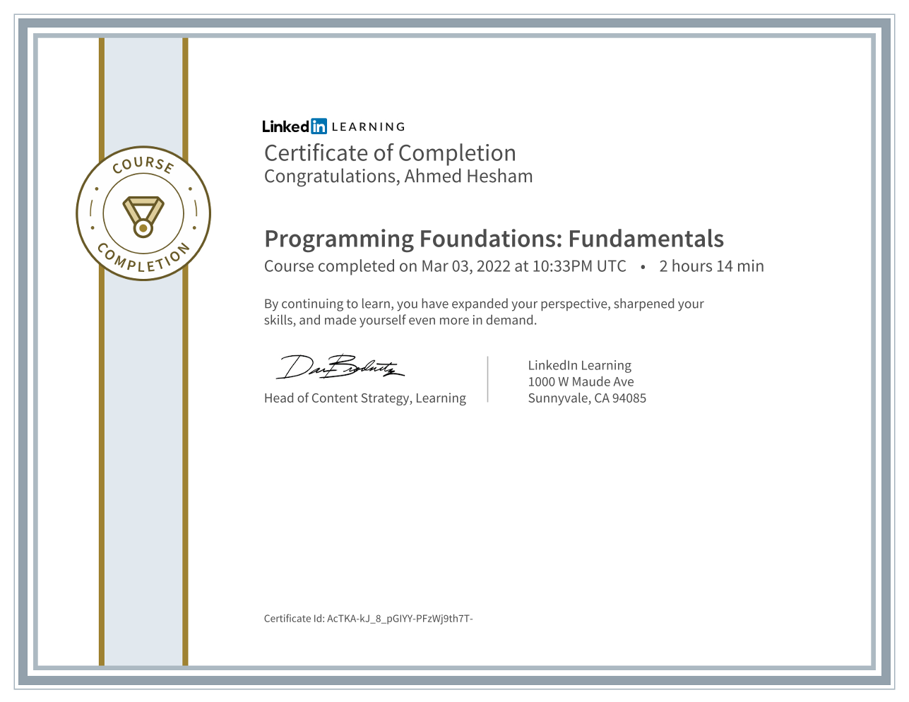

# Programming Foundations Fundamentals Course - Content preview

<h1>
  This is Programming Foundations Fundamentals Course :heart:
</h1>

Hi, My name is Ahmed Hesham and this is my apply what I learned in this course with the instructor

## Welcome! 👋

Thanks for checking out this JavaScript content.

**To complete this challenge, I studied for a long time and it was a very interesting trip and I learned a lot from Eng.Annyce Davis and I wish for her a great success and special thanks to those in charge of the Al-Bunyan Al-Marsous competition, especially Engineer Ahmed Fathi, for their efforts, and I wish for them a great success.**

### Course Link

